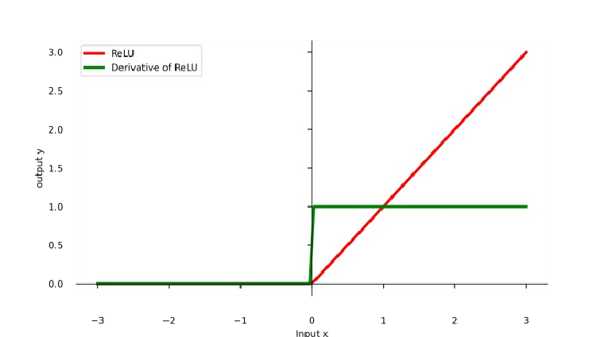
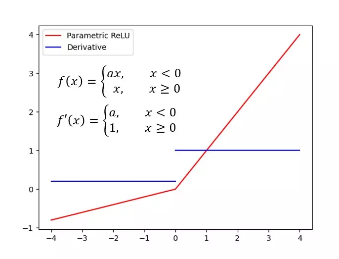
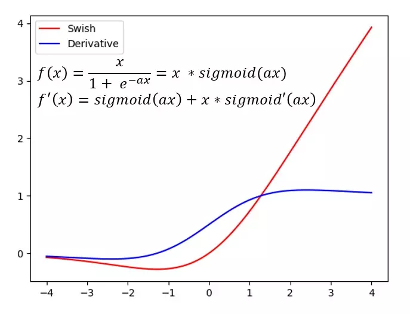
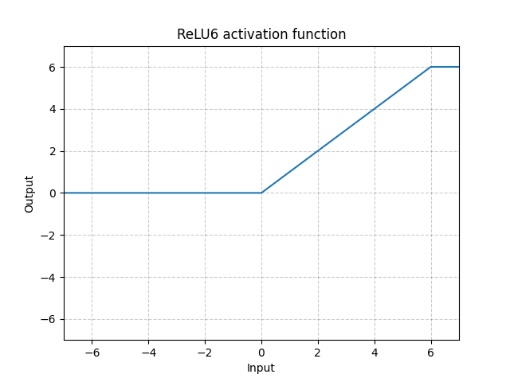
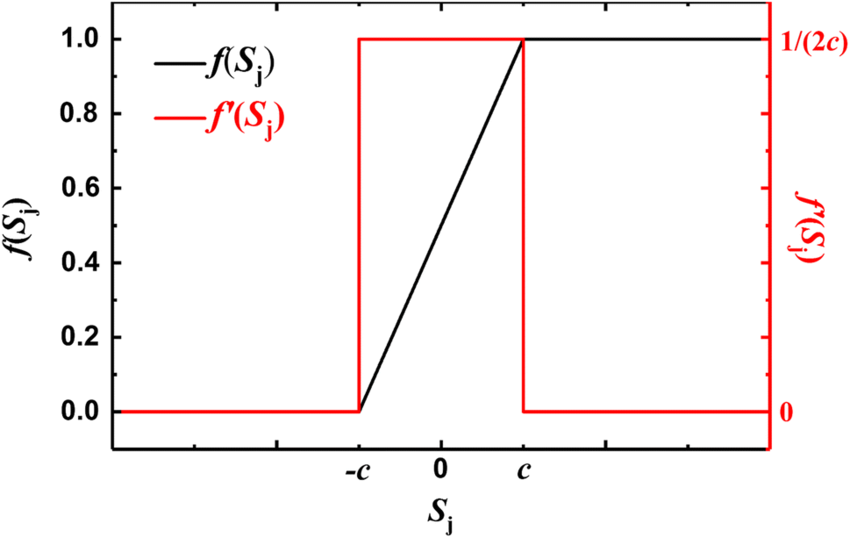
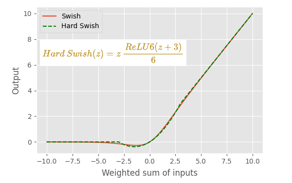

## Funções de Ativação Não Diferenciáveis em Deep Learning Moderno

Redes neurais profundas dependem de **funções de ativação** para introduzir não-linearidade. Curiosamente, muitas das ativações mais populares são *não diferenciáveis* em um ou mais pontos no seu domínio. Na prática, essa não diferenciação (geralmente confinada a um conjunto de medida zero nos inputs) raramente impede o treinamento – as bibliotecas de deep learning utilizam métodos de subgradiente ou definem derivadas arbitrárias nos pontos singulares.

## Funções de Ativação Não Diferenciáveis Comuns

Muitas funções de ativação amplamente utilizadas são definidas por partes, o que as torna não diferenciáveis em certos pontos de fronteira. Ainda assim, elas permanecem populares devido a benefícios como atenuar gradientes em desaparecimento ou melhorar a esparsidade. A Tabela 1 resume cada função de ativação, uma alternativa suave correspondente e exemplos de uso em modelos de grande escala.

**Tabela 1 – Ativações Não Diferenciáveis vs. Contrapartes Diferenciáveis**

| **Ativação (Não-dif)**                                                                                                                                              | **Contraparte Diferenciável**                                                                                                                                           | **Referências Principais & Teoria**                                                                                                                                                                                                                                                                               | **Uso em Modelos de Destaque**                                                                                                                                                                                                                         |
|---|---|---|---|
| **ReLU** (Rectified Linear Unit): f(x)= max(0,x) – não diferenciável em \( x=0 \).                                                                            | **Softplus**: f(x)=e^x/(1+e^x) (aproximação da ReLU), **GELU** (Gaussian Error Linear Unit).| Nair & Hinton [1] introduziram ReLU em RBMs, mostrando que redes profundas com ReLU treinam efetivamente. É rápida de computar; incentiva ativações esparsas. [Link](https://www.blopig.com/blog/2023/02/the-most-relu-iable-activation-function/#:~:text=The%20Rectified%20Linear%20Unit%20,0%20is%20not%20always%20zero)                                                                                                                                               | Quase todas as CNNs (ex.: [*ResNet*](https://d2l.ai/chapter_convolutional-modern/resnet.html) usa ReLU após cada convolução); AlphaFold2 (2020) utiliza ReLUs em seu tronco; versões mais antigas do GPT também.                                                                               
**ReLU**   | **Softplus**  | **GELU**  
| **Leaky ReLU**: f(x) = max(ax, x) (alpha =~ 0.01). Não-dif em 0.                                                | *Inclinação negativa:* **ELU** (Exponential Linear Unit) com derivada compatível em 0 (se a=1), ou **Swish** que tem inclinação negativa diferente de zero. | Maas et al. (2013) [3] introduziram [Leaky ReLU](https://arxiv.org/pdf/2012.07564#:~:text=Furthermore%2C%20Leaky%20ReLU%20,compared%20to%20the%20ReLU%20AF) para resolver o problema de “ReLU morta” ao permitir um gradiente pequeno quando \( x<0 \). Melhora moderadamente a convergência.                                                                                                                          | Frequente em detecção de objetos e GANs. [*YOLO v1* (2016)](https://viso.ai/computer-vision/yolo-explained/#:~:text=YOLO%20Explained%3A%20From%20v1%20to,prevent%20the%20%E2%80%9Cdying%20ReLU) usou Leaky ReLU para evitar neurônios mortos. Alguns [modelos inspirados no AlphaFold usam Leaky ReLU em camadas densas](https://pmc.ncbi.nlm.nih.gov/articles/PMC11121315/pdf/ijms-25-05247.pdf).                                                                           |
| **LeakyReLU**  | **ELU**  | **Swish**  | 
| **ReLU6**: f(x)=min(max(0,x),6). Limita a saída em 6; não-dif em 0 e 6.                                                                                     | *Teto suave:* ex.: **Sigmoid** f(x) = e^x / ((e^x) + 1) escalada para 6 (sigmoide satura assintoticamente)                                                                                           | Introduzida em CNNs para dispositivos móveis para robustez a quantização. Limita o intervalo de ativação em [0,6]. Sandler et al. (2018)[5] destacam que a ReLU6 é mais estável em operações de baixa precisão.                                                                                                                                      | Padrão em *MobileNet v1/v2* para manter ativações limitadas (ajuda em quantização de 8 bits). Também usada em algumas variantes quantizadas do GPT para inferência em dispositivos móveis.                                                                                 |
| **ReLU6**  | **Sigmoid**  | | |
| **Hard Sigmoid**: aproximação linear por partes da sigmoide f(x)=max[0,min(1, (x+1)/2)]. Não-dif nos pontos de transição. **Hard Tanh**: rampa linear truncada em \([-1,1]\). Não-dif em ±1. | **Sigmoid / Tanh** – funções sigmoides verdadeiramente suaves Tanh(x)= (e^x-e^-x) / (e^x+e^-x).                                                                                                                                                 | Hard sigmoid/tanh trocam precisão por velocidade. Evitam chamadas caras a exp()/tanh() ao usar segmentos lineares. Comum em modelos de recursos limitados.                                                                                                                                                            | *MobileNetV3* (Howard et al. 2019) [6] substituiu todas as sigmoides em módulos Squeeze-and-Excite por hard-sigmoid para reduzir latência. HardTanh é usada em algumas políticas de RL para restringir saídas de ação em \([-1,1]\).                                                |
| **Hardsigmoid**  | **Tanh**  | |
| **Hard Swish (h-swish)**: f(x)=x * (ReLU6(x+3)/6) . Combina ReLU6 com escalonamento linear; não-dif em (x=-3) e (x=3).  | **Mish**: f(x)=x * tanh(softplus(x) (suave, não-monotônica).                                                                                  | Howard et al. (2019) [6] apresentaram hard-swish como uma variante do swish mais rápida e compatível com quantização. Retém os benefícios de performance do swish, mas com componentes lineares por partes simples. Em testes, igualou a acurácia do swish com custo menor.                                                                      | *MobileNetV3* utiliza h-swish na maioria das camadas, ajudando a atingir eficiência de ponta. Também adotada em algumas variantes do EfficientNet para dispositivos móveis.                                                                                                    |
| **Hardswish**  | **Mish**  | |                                       |

## Impacto do Tamanho da Rede em Ativações Não Diferenciáveis

Questão: *aumentar* a largura da rede ou o número de parâmetros reduz a chance de inputs caírem nas regiões não diferenciáveis de uma ativação? Intuitivamente, com mais neurônios e inicializações de pesos aleatórias, é improvável que vários neurônios fiquem exatamente na dobra (por exemplo, entrada = 0 no ReLU) ao mesmo tempo – a “fronteira” de cada neurônio é um hiperplano no espaço de entrada de alta dimensão, que um input contínuo aleatório cruzaria com probabilidade quase zero (?). Quase sempre as entradas da ReLU não serão exatamente zero; ficarão na região linear ou na região em que a saída é zero, onde a função é diferenciável (existem derivadas laterais) e o backprop funciona normalmente. Mesmo se a entrada estiver exatamente na dobra da ReLU, as bibliotecas modernas simplesmente escolhem um subgradiente (normalmente tratam \( f'(0)=0 \)) para prosseguir.

A **superparametrização** (ter mais neurônios do que o estritamente necessário) tende a facilitar o treinamento de modelos não diferenciáveis, não dificultá-lo. Trabalhos teóricos recentes mostram que redes ReLU suficientemente largas têm paisagens de otimização mais “amigáveis”. Por exemplo, Du et al. (2019) [12] provaram que uma rede ReLU de duas camadas com um número grande de neurônios ocultos pode ser treinada até o ótimo global com descida de gradiente – essencialmente, a vasta parametrização evita mínimos locais ruins apesar da não suavidade da ReLU [12]. De modo similar, Safran & Shamir (2017) [13] observaram empiricamente que adicionar alguns neurônios extras a uma rede ReLU pequena reduziu drasticamente a ocorrência de mínimos locais não-globais. Nos experimentos, uma rede com (n=k+2) (dois neurônios ocultos além da dimensionalidade dos dados) não apresentou mínimos locais espúrios durante o treinamento, enquanto a rede com (n=k) acabou presa em mínimos subótimos [17], sugerindo que a superparametrização pode “diluir” as complexidades na superfície de perda, efetivamente contornando problemas ligados às dobras não diferenciáveis das funções de ativação (?).

Do ponto de vista prático, redes grandes também atenuam problemas como o “dying ReLU”. Esse fenômeno ocorre quando neurônios param de responder, emitindo 0 para todas as entradas (portanto gradiente zero), algo possível se a ReLU nunca recebe valores positivos. Em redes muito estreitas ou rasas, uma inicialização ruim ou taxa de aprendizado alta pode “matar” uma fração grande de neurônios. Mas em arquiteturas modernas, técnicas como inicialização adequada (He et al. 2015) [4], batch normalization e conexões residuais garantem que a maioria das ReLUs receba inputs tanto positivos quanto negativos, mantendo-os ativos. Além disso, redes hoje contam com centenas ou milhares de neurônios ReLU por camada; mesmo se alguns pararem, muitos outros continuam aprendendo. Empiricamente, os problemas vistos raramente aparecem em modelos massivos como ResNets ou Transformers – a abundância de parâmetros oferece redundância.

Ativações não diferenciáveis como ReLU continuam sendo pilares do deep learning, oferecendo simplicidade e eficácia apesar de seus “cantos” pontuais. O design moderno de redes utiliza componentes lineares (camadas densas, convolucionais, projeções de atenção) e muitas vezes contorna as não diferenciações de ativação por pura superparametrização e arquiteturas inteligentes (assegurando “diferenciabilidade quase em todo lugar” na prática). Tanto evidências empíricas quanto teóricas indicam que, à medida que as redes ficam mais profundas e largas, os desafios colocados por pontos não diferenciáveis diminuem. No fim das contas, a escolha da ativação gira em torno de um balanço entre suavidade matemática e considerações práticas como velocidade, esparsidade e facilidade de otimização. O fato de ReLU seguir dominante – mesmo com o surgimento de ativações suaves (Swish, GELU) – mostra que, com capacidade de rede e técnicas de treinamento suficientes, uma função linear por partes pode igualar (ou superar) muitas alternativas suaves [link](https://www.blopig.com/blog/2023/02/the-most-relu-iable-activation-function/) cita [18].

## Referências

(⊕ indica foco em função de ativação não diferenciável)

1. [**Nair, V. & Hinton, G. (2010).** *Rectified Linear Units improve Restricted Boltzmann Machines*. Proc. ICML.](https://icml.cc/Conferences/2010/papers/432.pdf) ⊕  
2. [**Glorot, X. et al. (2011).** *Deep Sparse Rectifier Neural Networks*. AISTATS.](https://proceedings.mlr.press/v15/glorot11a/glorot11a.pdf) ⊕  
3. [**Maas, A. et al. (2013).** *Rectifier Nonlinearities Improve Neural Network Acoustic Models*. Proc. ICML.](https://ai.stanford.edu/~amaas/papers/relu_hybrid_icml2013_final.pdf) ⊕  
4. [**He, K. et al. (2015).** *Delving Deep into Rectifiers: Surpassing Human-Level Performance on ImageNet*. Proc. ICCV.](https://www.cv-foundation.org/openaccess/content_iccv_2015/papers/He_Delving_Deep_into_ICCV_2015_paper.pdf) ⊕  
5. [**Sandler, M. et al. (2018).** *MobileNetV2: Inverted Residuals and Linear Bottlenecks*. Proc. CVPR.](https://openaccess.thecvf.com/content_cvpr_2018/papers/Sandler_MobileNetV2_Inverted_Residuals_CVPR_2018_paper.pdf) ⊕  
6. [**Howard, A. et al. (2019).** *Searching for MobileNetV3*. Proc. ICCV.](https://openaccess.thecvf.com/content_ICCV_2019/papers/Howard_Searching_for_MobileNetV3_ICCV_2019_paper.pdf) ⊕  
7. [**Goodfellow, I. et al. (2013).** *Maxout Networks*. Proc. ICML.](https://proceedings.mlr.press/v28/goodfellow13.pdf) ⊕  
8. [**Courbariaux, M. et al. (2016).** *Binarized Neural Networks: Training Deep Neural Networks with Weights and Activations Constrained to +1 ou -1*. NeurIPS.](https://papers.nips.cc/paper_files/paper/2016/file/d8330f857a17c53d217014ee776bfd50-Paper.pdf) ⊕  
9. [**Rastegari, M. et al. (2016).** *XNOR-Net: ImageNet Classification Using Binary Convolutional Neural Networks*.](https://arxiv.org/pdf/1603.05279) ⊕  
10. [**Vaswani, A. et al. (2017).** *Attention is All You Need*. NeurIPS.](https://arxiv.org/pdf/1706.03762)  
11. [**Lan, Z. et al. (2020).** *ALBERT: A Lite BERT for Self-supervised Learning of Language Representations*. ICLR.](https://arxiv.org/pdf/1909.11942)  
12. [**Du, S. et al. (2019).** *Gradient Descent Provably Optimizes Over-parameterized Neural Networks*. ICLR.](https://arxiv.org/pdf/1810.02054)  
13. [**Safran, I. & Shamir, O. (2017).** *Spurious Local Minima are Common in Two-Layer ReLU Neural Networks*. ICML.](https://arxiv.org/pdf/1712.08968)
14. [Gradient slides](http://www.seas.ucla.edu/~vandenbe/236C/lectures/gradient.pdf)
15. [**Bolte, J. & Pauwels, E. (2020).** *Conservative set valued fields, automatic differentiation, stochastic gradient methods and deep learning*](https://arxiv.org/pdf/1909.10300) ⊕
16. [**Kakade, S. & Lee, J. (2018).** *Provably Correct Automatic Subdifferentiation for Qualified Programs*](https://arxiv.org/pdf/1809.08530) ⊕
17. [**Safran, I. & Shamir, O. (2021).** *The Effects of Mild Over-parameterization on the Optimization Landscape of Shallow ReLU Neural Networkss*](https://proceedings.mlr.press/v134/safran21a/safran21a.pdf) ⊕
18. [**Naitzat, G., Zhitnikov, A., Lim, L. (2020).** *TOPOLOGY OF DEEP NEURAL NETWORKS*](https://arxiv.org/pdf/2004.06093) ⊕
19. [Material](https://cs182sp21.github.io/static/discussions/dis4-sol.pdf)
